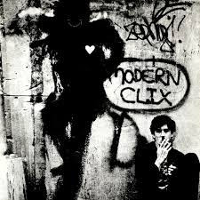

# EJERCICIO 6 DIA 5

Aca explico detalladamente cada sección del código HTML y CSS utilizado para crear una página web sobre la música.

## Estructura del Proyecto
```
project/
├── index.html         # Archivo principal HTML
├── style.css          # Estilos CSS
├── _img/              # Carpeta para imágenes
├── _css/              # Carpeta para estilos
└── README.md          # Documentación
```

# index.html 

### 1. Estructura Básica HTML
```html
<!DOCTYPE html>
<html lang="es">
<head>
    <meta charset="UTF-8">
    <meta name="viewport" content="width=device-width, initial-scale=1.0">
    <link rel="stylesheet" href="./_css/style.css">
    <link rel="icon" href="./_img/logo.png" type="image/x-icon">
    <title>Música</title>
</head>
```
- `<!DOCTYPE>`: Define el tipo de documento como HTML5
- `lang="es"`: Indica que el idioma principal es español
- `meta charset`: Especifica la codificación de caracteres UTF-8
- `viewport`: Configura la visualización para dispositivos móviles
- `link stylesheet`: Enlaza el archivo CSS
- `link icon`: Establece el icono de la pestaña del navegador

### 2. Header y Navegación
```html
<header class="header">
    <nav class="nav container">
        <a href="#inicio" class="logo">
            
            <span class="logo-text">SAY NO MORE</span>
        </a>
        <button class="nav-toggle" onclick="toggleMenu()">☰</button>
        <ul class="nav-menu">
            <li><a href="#inicio">Inicio</a></li>
            <li><a href="#music-genres">Estilos Musicales</a></li>
        </ul>
    </nav>
</header>
```
- Contiene el encabezado del sitio, logo y menú de navegación
- `nav-toggle`: Botón para menú móvil con función JavaScript
- `nav-menu`: Lista de enlaces

### 3. Sección Hero (Portada)
```html
<section class="hero">
    <div class="container">
        <h1>Bienvenido a <span class="hero__highlight">Mi Página</span></h1>
        <p>Descubre contenido increíble sobre emociones, música y más.</p>
        <div class="hero__actions">
            <a href="#emotions" class="btn btn--primary">Explorar Emociones</a>
            <a href="#music-genres" class="btn btn--secondary">Ver Galería</a>
        </div>
    </div>
</section>
```
- Título principal, descripción y botones de acción
- `.hero: `Sección destacada de bienvenida con fondo, título, descripción y botones.
- `.hero_title:`Título principal con énfasis visual.
- `.hero__description:`Texto introductorio.
- `.btn: `Botones reutilizables.


### 4. Sección de Estilos Musicales
```html
<section id="music-genres" class="music-section custom-genres">
    <h2>Estilos Musicales</h2>
    <p>La música de cada género...</p>
    <div class="music-grid">
        <div class="music-item">
            
            <div class="overlay-info">
                <h4>Rock</h4>
                <p>Una explosión de energía...</p>
            </div>
        </div>
    </div>
</section>
```
- Imágenes con información superpuesta
- `.music-grid:` Galería con imágenes de géneros musicales.
- `.overlay-info:` Capa de texto sobre la imagen que aparece al hacer hover.
- Permite navegar por géneros y sentir su identidad visual.


### 5. Sección de Álbumes
```html
<section id="albums" class="products-section">
    <h2>Álbumes Importantes</h2>
    <div class="album-grid">
        <article class="album-card">
            <div class="album-image-container">
                
                <span class="album-badge">Clásico</span>
            </div>
            <div class="album-content">
                <h3>Clics Modernos</h3>
                <p>Un álbum icónico...</p>
                <button onclick="window.open('https://...')">Escuchar Álbum</button>
            </div>
        </article>
    </div>
</section>
```
- Tarjetas visuales con info y botón externo
- `.album-card:` Contenedor con estilo de tarjeta.
- `.album-badge:`Etiqueta decorativa.
- `.album-actions:`Contenedor de botón con enlace externo.

### 6. Estadísticas Musicales
```html
<main class="music-stats">
    <section class="music-stat-section">
        <h2>Estadísticas Musicales</h2>
        <div class="stats-grid">
            <div class="stat-card top-track">
                <h3>Track más Popular</h3>
                <div class="stat-value">Take Five</div>
                <p>Interpretado por Dave Brubeck...</p>
            </div>
        </div>
    </section>
</main>
```
- Datos musicales representados en tarjetas
- `.stats-grid:` Muestra tarjetas en 4 columnas.
- `.stat-card: `Cada tarjeta representa un dato.
- `.top-track, .top-genre, etc.:`Aplican color de fondo distinto según tipo.
- Contenido pensado para mostrar métricas musicales destacadas.


### 7. Emociones
```html
<section id="emotions" class="section emotions">
    <h2>Cómo la Música Nos Hace Sentir</h2>
    <div class="emotion-card">
        <h3>Felicidad</h3>
        <p>Las melodías alegres...</p>
    </div>
</section>
```
- Tarjetas con emociones

### 8. Footer
```html
<footer id="contact" class="footer">
    <div class="container">
        <h2 class="footer__title">¡Hablemos!</h2>
        <p>¿Tienes alguna idea o proyecto en mente?</p>
        <a href="mailto:correo@ejemplo.com" class="contact-link">Envíame un correo</a>
    </div>
</footer>
```
- `.footer__title:` Título de la sección de contacto.

- `.footer__description:` Mensaje motivacional.

- `contact-link:` Enlace estilo botón para correo.

### 9. JavaScript
```html
<script>
function toggleMenu() {
    const navMenu = document.querySelector('.nav-menu');
    navMenu.classList.toggle('active');
}
</script>
```
- Permite alternar el menú móvil

---

# style.css 

### 1. Variables CSS
```css
:root {
    --color-primary: #6a25eb;
    --font-primary: system-ui, sans-serif;
}
```
- Variables para colores y tipografía

### 2. Estilos Generales
```css
body {
    font-family: var(--font-primary);
    min-height: 100vh;
    display: flex;
    flex-direction: column;
}
```
- Diseño base y layout

### 3. Header y Navegación
```css
.header {
    position: sticky;
    top: 0;
}

.nav-menu {
    display: flex;
}

.nav-link::after {
    content: '';
    transition: width var(--transition-normal);
}
```
- Navegación con efectos hover

### 4. Hero
```css
.hero {
    background-image: url('../_img/fondo.avif');
}
```
- Imagen de fondo adaptable

### 5. Grid de Géneros
```css
.music-grid {
    display: grid;
    gap: 2rem;
}
```
- Grid de géneros con efecto hover
- Uso de `grid` para distribución fluida y responsive.

- `auto-fill` permite que se llenen automáticamente las columnas.

### 6. Álbumes
```css
.album-card {
    border-radius: 12px;
    transition: transform 0.3s ease;
}
```
- Tarjetas responsivas

### 7. Estadísticas
```css
.stats-grid {
    display: grid;
    gap: var(--space-md);
}
```
- Grid con tarjetas de colores

### 8. Footer
```css
.footer {
    background-color: rgba(164, 137, 207, 0.9);
}
```
- Estilo del pie de página

### 9. Media Queries
```css
@media (max-width: 768px) {
    .nav-menu {
        display: none;
    }
}
```
- Ajustes para dispositivos pequeños

